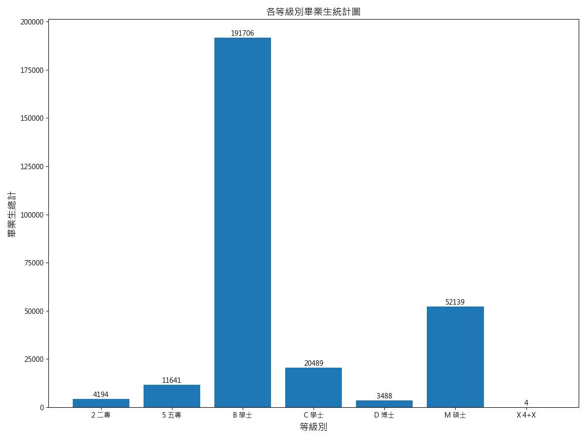

# HW1: Data processing

請自行找一組與教育相關的資料，並對這組資料提問10個問題後，使用Pandas回答，加上註解說明與圖形視覺化。

> 註：輸出檔案與圖表將儲存在[output](output)資料夾中。

## 載入套件與前處理

```python= 
# 載入套件
from pickle import decode_long
import pandas as pd
import matplotlib
import matplotlib.pyplot as plt

# 設定字體
matplotlib.rc("font", family="Microsoft JhengHei")

# 讀取csv檔案
data = pd.read_csv("graduatesc.csv")

# 以0填補缺失值(" -")，轉換帶有逗號的數字，並轉換數值形態
data = data.replace(" -", 0)
data["上學年畢業生男"] = data["上學年畢業生男"].str.replace(",", "").fillna(0).astype(int)
data["上學年畢業生女"] = data["上學年畢業生女"].str.replace(",", "").fillna(0).astype(int)
```

## 問題一：該資料集共統計了多少細學類系所？

```python=18
# -- Q1: 各細學類系所數量表 -- #
# 統計各細學類出現次數
category_counts = data["細學類名稱"].value_counts()
category_counts_df = pd.DataFrame(
    {"細學類名稱": category_counts.index, "系所數量": category_counts.values}
)
category_counts_df = category_counts_df.sort_values(by="系所數量", ascending=False)

# 儲存與印出圖表
category_counts_df.to_csv("output/各細學類系所數量表.csv", index=False, encoding="big5")
print(category_counts_df.to_string(index=False))
```

輸出檔案預覽：

| 細學類名稱             | 系所數量 |
| ------------------------ | --------- |
| 企業管理細學類         | 250       |
| 電機與電子工程細學類 | 230       |
| 其他商業及管理細學類 | 176       |
| 旅遊觀光細學類         | 160       |
| 機械工程細學類         | 156       |
...

## 問題二：各進修別都有多少畢業生？

```python=30
# -- Q2: 各進修別畢業生統計圖 -- #
# 計算畢業生總計
data["畢業生總計"] = data["上學年畢業生男"] + data["上學年畢業生女"]
total_graduates_by_study = data.groupby("日間_進修別")["畢業生總計"].sum().reset_index()

# 繪製圖表
plt.figure(figsize=(12, 9))
plt.bar(
    total_graduates_by_study["日間_進修別"],
    total_graduates_by_study["畢業生總計"],
)
plt.title("各進修別畢業生統計圖", fontsize=14)
plt.xlabel("日間_進修別", fontsize=14)
plt.ylabel("畢業生總計", fontsize=14)

# 添加實際數值標籤
for i, value in enumerate(total_graduates_by_study["畢業生總計"]):
    plt.text(i, value, str(value), ha="center", va="bottom")

plt.tight_layout()

# 儲存與印出圖表
plt.savefig("output/各進修別畢業生統計圖.png")
plt.show()
plt.clf()

```
 
輸出檔案預覽：


## 問題三：各等級別都有多少畢業生？

```python=56
# -- Q3: 各等級別畢業生統計圖 -- #
# 計算畢業生總計
data["畢業生總計"] = data["上學年畢業生男"] + data["上學年畢業生女"]
total_graduates_by_level = data.groupby("等級別")["畢業生總計"].sum().reset_index()

# 繪製圖表
plt.figure(figsize=(12, 9))
plt.bar(
    total_graduates_by_level["等級別"],
    total_graduates_by_level["畢業生總計"],
)
plt.title("各等級別畢業生統計圖", fontsize=14)
plt.xlabel("等級別", fontsize=14)
plt.ylabel("畢業生總計", fontsize=14)

# 添加實際數值標籤
for i, value in enumerate(total_graduates_by_level["畢業生總計"]):
    plt.text(i, value, str(value), ha="center", va="bottom")

plt.tight_layout()

# 儲存與印出圖表
plt.savefig("output/各等級別畢業生統計圖.png")
plt.show()
plt.clf()
```

輸出檔案預覽：



## 問題四：畢業生的男女人數比例？

```python=82
# -- Q4: 畢業生男女比例圓餅圖 -- #
# 計算男女畢業生總數
male_graduates = data["上學年畢業生男"].sum()
female_graduates = data["上學年畢業生女"].sum()


# 客製標籤
def q4_labels(s, d):
    val = int(round(s / 100.0 * sum(d)))
    return f"{s:.1f}%\n({val}人)"


# 繪製圖表
plt.pie(
    [male_graduates, female_graduates],
    labels=["男", "女"],
    colors=["lightblue", "lightpink"],
    autopct=lambda i: q4_labels(i, [male_graduates, female_graduates]),
    startangle=90,
    shadow=True,
    explode=(0.1, 0),
)
plt.title("畢業生男女比例圓餅圖", fontsize=14)

plt.tight_layout()

# 儲存與印出圖表
plt.savefig("output/畢業生男女比例圓餅圖.png")
plt.show()
plt.clf()
```

輸出檔案預覽：


## 問題五：各進修別的畢業生男女人數比例？

```python=113
# -- Q5: 各進修別男女畢業生人數統計圖 -- #
# 計算各進修別畢業生男女人數
graduates_by_study = data.groupby("日間_進修別")[["上學年畢業生男", "上學年畢業生女"]].sum().reset_index()

# 設定直條寬度、x軸刻度、x軸標籤
bar_width = 0.45
x = range(len(graduates_by_study))
plt.xticks([i + bar_width / 2 for i in x], graduates_by_study["日間_進修別"])

# 繪製圖表
plt.bar(
    x,
    graduates_by_study["上學年畢業生男"],
    width=bar_width,
    label="男",
    color="lightblue",
)
plt.bar(
    [i + bar_width for i in x],
    graduates_by_study["上學年畢業生女"],
    width=bar_width,
    label="女",
    color="lightpink",
)

plt.title("各進修別男女畢業生人數統計圖")
plt.xlabel("進修別")
plt.ylabel("畢業生人數")
plt.legend()

# 添加實際數值標籤
for i, v in enumerate(graduates_by_study["上學年畢業生男"]):
    plt.text(i, v + 5, str(v), ha="center", va="bottom", fontsize=10)
for i, v in enumerate(graduates_by_study["上學年畢業生女"]):
    plt.text(i + bar_width, v + 5, str(v), ha="center", va="bottom", fontsize=10)

plt.tight_layout()

# 儲存與印出圖表
plt.savefig("output/各進修別男女畢業生人數統計圖.png")
plt.show()
plt.clf()
```

輸出檔案預覽：


## 問題六：各等級別的畢業生男女人數比例？

```python=156
# -- Q6: 各等級別男女畢業生人數統計圖 -- #
# 計算各等級別畢業生男女人數
graduates_by_level = data.groupby("等級別")[["上學年畢業生男", "上學年畢業生女"]].sum().reset_index()

# 設定直條寬度、x軸刻度、x軸標籤
bar_width = 0.45
x = range(len(graduates_by_level))
plt.xticks([i + bar_width / 2 for i in x], graduates_by_level["等級別"])

# 繪製圖表
plt.bar(
    x,
    graduates_by_level["上學年畢業生男"],
    width=bar_width,
    label="男",
    color="lightblue",
)
plt.bar(
    [i + bar_width for i in x],
    graduates_by_level["上學年畢業生女"],
    width=bar_width,
    label="女",
    color="lightpink",
)

plt.title("各等級別男女畢業生人數統計圖")
plt.xlabel("等級別")
plt.ylabel("畢業生人數")
plt.legend()

# 添加實際數值標籤
for i, v in enumerate(graduates_by_level["上學年畢業生男"]):
    plt.text(i, v + 5, str(v), ha="center", va="bottom", fontsize=10)
for i, v in enumerate(graduates_by_level["上學年畢業生女"]):
    plt.text(i + bar_width, v + 5, str(v), ha="center", va="bottom", fontsize=10)

plt.tight_layout()

# 儲存與印出圖表
plt.savefig("output/各等級別男女畢業生人數統計圖.png")
plt.show()
plt.clf()
```

輸出檔案預覽：


## 問題七：畢業人數前二十的細學類？

```python=199
# -- Q7: 畢業人數前二十細學類統計圖 -- #
# 統計各細學類畢業人數並排序
graduates_by_category = data.groupby("細學類名稱")["畢業生總計"].sum().reset_index()
graduates_by_category = graduates_by_category.sort_values(
    by="畢業生總計",
    ascending=False,
)

# 取前二十名
q7_top20 = graduates_by_category.head(20)
q7_top20 = q7_top20.sort_values(by="畢業生總計", ascending=True)

# 繪製圖表
plt.barh(
    q7_top20["細學類名稱"],
    q7_top20["畢業生總計"],
    color="purple",
)

plt.title("畢業人數前二十細學類統計圖")
plt.xlabel("畢業人數")
plt.ylabel("細學類名稱")

# 添加實際數值標籤
for i, v in enumerate(q7_top20["畢業生總計"]):
    plt.text(v, i, str(v), ha="left", va="center", fontsize=10)

plt.tight_layout()

# 儲存與印出圖表
plt.savefig("output/畢業人數前二十細學類統計圖.png")
plt.show()
plt.clf()
```

輸出檔案預覽：


## 問題八：畢業男性人數前十的細學類的男女比例？

```python=233
# -- Q8: 畢業男生人數前十細學類男女人數統計圖 -- #
# 統計各細學類畢業男生人數並排序
boy_graduates_by_category = (
    data.groupby("細學類名稱")[["上學年畢業生男", "上學年畢業生女"]].sum().reset_index()
)
boy_graduates_by_category = boy_graduates_by_category.sort_values(
    by="上學年畢業生男",
    ascending=False,
)

# 取前十名
boy_graduates_by_category = boy_graduates_by_category.head(10)
boy_graduates_by_category = boy_graduates_by_category.sort_values(
    by="上學年畢業生男",
    ascending=True,
)

# 設定直條寬度、y軸刻度、y軸標籤
bar_width = 0.3
y = range(len(boy_graduates_by_category))
plt.yticks([i + bar_width / 2 for i in y], boy_graduates_by_category["細學類名稱"])

# 繪製圖表
plt.barh(
    [i + bar_width for i in y],
    boy_graduates_by_category["上學年畢業生男"],
    label="男",
    color="lightblue",
    height=bar_width,
)
plt.barh(
    y,
    boy_graduates_by_category["上學年畢業生女"],
    label="女",
    color="lightpink",
    height=bar_width,
)

plt.title("畢業男生人數前十細學類男女人數統計圖")
plt.xlabel("畢業生人數")
plt.ylabel("細學類名稱")
plt.legend()

# 添加實際數值標籤
for i, v in enumerate(boy_graduates_by_category["上學年畢業生男"]):
    plt.text(v, i + bar_width, str(v), ha="left", va="center", fontsize=10)

for i, v in enumerate(boy_graduates_by_category["上學年畢業生女"]):
    plt.text(v, i, str(v), ha="left", va="center", fontsize=10)

plt.tight_layout()

# 儲存與印出圖表
plt.savefig("output/畢業男生人數前十細學類男女人數統計圖.png")
plt.show()
plt.clf()
```

輸出檔案預覽：


## 問題九：畢業女性人數前十的細學類的男女比例？

```python=290
# -- Q9: 畢業女生人數前十細學類男女人數統計圖 -- #
# 統計各細學類畢業女生人數並排序
boy_graduates_by_category = (
    data.groupby("細學類名稱")[["上學年畢業生男", "上學年畢業生女"]].sum().reset_index()
)
boy_graduates_by_category = boy_graduates_by_category.sort_values(
    by="上學年畢業生女",
    ascending=False,
)

# 取前十名
boy_graduates_by_category = boy_graduates_by_category.head(10)
boy_graduates_by_category = boy_graduates_by_category.sort_values(
    by="上學年畢業生女",
    ascending=True,
)

# 設定直條寬度、y軸刻度、y軸標籤
bar_width = 0.3
y = range(len(boy_graduates_by_category))
plt.yticks([i + bar_width / 2 for i in y], boy_graduates_by_category["細學類名稱"])

# 繪製圖表
plt.barh(
    [i + bar_width for i in y],
    boy_graduates_by_category["上學年畢業生女"],
    label="女",
    color="lightpink",
    height=bar_width,
)
plt.barh(
    y,
    boy_graduates_by_category["上學年畢業生男"],
    label="男",
    color="lightblue",
    height=bar_width,
)

plt.title("畢業女生人數前十細學類男女人數統計圖")
plt.xlabel("畢業生人數")
plt.ylabel("細學類名稱")
plt.legend()

# 添加實際數值標籤
for i, v in enumerate(boy_graduates_by_category["上學年畢業生女"]):
    plt.text(v, i + bar_width, str(v), ha="left", va="center", fontsize=10)

for i, v in enumerate(boy_graduates_by_category["上學年畢業生男"]):
    plt.text(v, i, str(v), ha="left", va="center", fontsize=10)

plt.tight_layout()

# 儲存與印出圖表
plt.savefig("output/畢業女生人數前十細學類男女人數統計圖.png")
plt.show()
plt.clf()
```

輸出檔案預覽：


## 問題十：畢業人數前十細學類佔所有細學類的比例？

```python=347
# -- Q10: 畢業人數前十細學類比例圖 -- #
graduates_by_category = graduates_by_category.sort_values(
    by="畢業生總計",
    ascending=False,
)

# 取前十名與計算其他總和
q10_top10 = graduates_by_category.head(10)
q10_others = pd.DataFrame(
    {
        "細學類名稱": ["其他"],
        "畢業生總計": [graduates_by_category["畢業生總計"][10:].sum()],
    }
)

q10_top10 = pd.concat([q10_top10, q10_others])

# 繪製圖表
plt.pie(
    q10_top10["畢業生總計"],
    autopct=lambda i: q4_labels(i, q10_top10["畢業生總計"]),
    labels=q10_top10["細學類名稱"],
    startangle=90,
    explode=(0.1, 0.1, 0.1, 0.1, 0.1, 0, 0, 0, 0, 0, 0),
    pctdistance=0.85,
    textprops={"fontsize": 9},
)
plt.title("畢業人數前十細學類比例圖", fontsize=14)

plt.tight_layout()

# 儲存與印出圖表
plt.savefig("output/畢業人數前十細學類比例圖.png")
plt.show()
plt.clf()
```

輸出檔案預覽：


