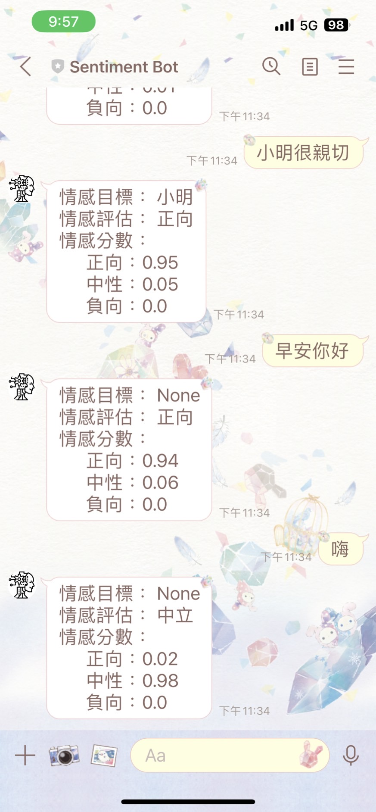

# HW3: Sentiment Analysis Line Bot

## Part 1: Azure 語言服務

## Part 2: Line Bot

程式重點修改部分在約莫第75行的函數 `azure_sentiment` 中。

> 註：[程式碼連結](app.py)

#### Line Bot screenshot

Part 1.
。先了解Azure語言服務有哪些，然後請試著規劃一個運用語言服務的教育應用
。如果可能，做一個小實作
Part 2. 完成上課指定練習1.顯示分數2.中文：正向/中性/負向3.把取得的主詞也顯示出來
(記得附上程式碼/Line截圖)
